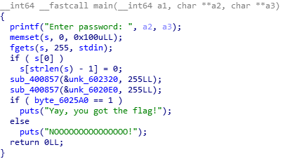
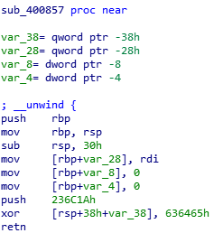
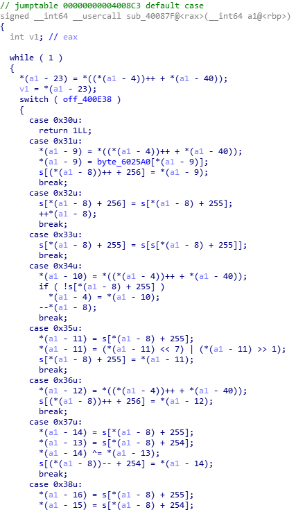
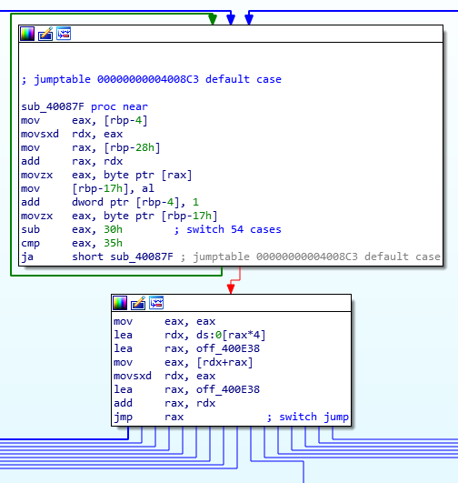
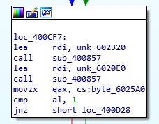

The algorithm is quite self explanatory, the only interesting part is the `sub_400857(&unk_6020E0, 255LL)` call. When converted to the pseudocode, it shows nothing.


Checking the assembly code of `sub_400857` reveals that it initiates the parameters and then modifies the return address to start the encryption routine. Return address modification is used to hide the function from the referred functions, thus confusing IDA.



Stepping through the `sub_400857` function reveals the hidden `sub_40087F` function.






This function basically emulates a VM. `[rbp-4]` is the instruction pointer, `[rbp-8]` is the data pointer and `[rbp-28]` holds the bytecodes of the current code. If you check `sub_400857`, you'll see that these parameters are getting initiated

In the main, `sub_400857` is called twice with two different parameters, `unk_602320` and `unk_6020E0`. Those are the bytecodes executed within the VM.



I've written a python script to emulate this VM to understand it better. You can find it below or in [VM.py](VM.py)

<details><summary>VM.py</summary>
<p>

```python
unk_602320="""31 80 63 32 32 64 80 33  34 12 36 01 38 32 32 39
34 03 36 23 39 34 1B 36  00 64 00 36 00 64 80 30
67 56 6B 59 70 33 73 36  76 39 79 24 42 26 45 29
48 40 4D 63 51 65 54 68  57 6D 5A 71 34 74 37 77
21 7A 25 43 2A 46 2D 4A  61 4E 64 52 67 55 6A 58
6E 32 72 35 75 38 78 2F  41 3F 44 28 47 2B 4B 62
50 65 53 68 56 6D 59 70  33 73 36 76 39 79 24 42
26 45 29 48 40 4D 63 51  66 54 6A 57 6E 5A 72 34
74 37 77 21 7A 25 43 2A  46 2D 4A 61 4E 64 52 67
55 6B 58 70 32 73 35 76  38 78 2F 41 3F 44 28 47
2B 4B 62 50 65 53 68 56  6D 59 71 33 74 36 77 39
7A 24 42 26 45 29 48 40  4D 63 51 66 54 6A 57 6E
5A 72 34 75 37 78 21 41  25 44 2A 46 2D 4A 61 4E
64 52 67 55 6B 58 70 32  73 35 76 38 79 2F 42 3F
45 28 48 2B 4B 62 50 65  53 68 56 6D 59 71 33 74
36 77 39 7A 24 43 26 46  29 4A 40 4E 63 51 66 54
6A 57 6E 5A 72 34 75 37  78 21 41 25 44 2A 47 2D
4B 61 50 64 53 67 55 6B  58 70 32 73 35 76 38 79
2F 42 3F 45 28 48 2B 4D  62 51 65 54 68 57 6D 59
71 33 74 36 77 39 7A 24  43 26 46 29 4A 40 4E 63
52 66 55 6A 58 6E 32 72  34 75 37 78 21 41 25 44
2A 47 2D 4B 61 50 64 53  67 56 6B 59 70 33 73 36
76 39 79 2F 42 3F 45 28  48 2B 4D 62 51 65 54 68
57 6D 5A 71 34 74 37 77  21 7A 25 43 26 46 29 4A
40 4E 63 52 66 55 6A 58  6E 32 72 35 75 38 78 2F
41 3F 44 28 47 2D 4B 61  50 64 53 67 56 6B 59 70
33 73 36 76 39 79 24 42  26 45 29 48 40 4D 62 51
65 54 68 57 6D 5A 71 34  74 37 77 21 7A 25 43 2A
46 2D 4A 61 4E 64 52 66  55 6A 58 6E 32 72 35 75
38 78 2F 41 3F 44 28 47  2B 4B 62 50 65 53 68 56
6B 59 70 33 73 36 76 39  79 24 42 26 45 29 48 40
4D 63 51 66 54 6A 57 6E  5A 71 34 74 37 77 21 7A
25 43 2A 46 2D 4A 61 4E  64 52 67 55 6B 58 70 32
73 35 75 38 78 2F 41 3F  44 28 47 2B 4B 62 50 65""".split()
unk_602320=[int("0x"+x,16) for x in unk_602320]

unk_6020E0="""31 80 32 32 64 80 33 32  34 28 35 36 63 37 36 98
38 61 62 31 80 36 0A 38  65 39 34 20 36 00 64 00
36 01 38 32 32 37 34 02  30 2A 47 2D 4B 61 50 64
53 67 56 6B 59 70 32 73  35 76 38 79 2F 42 3F 45
28 48 2B 4D 62 51 65 54  68 57 6D 5A 71 34 74 36
77 39 7A 24 43 26 46 29  4A 40 4E 63 52 66 55 6A
58 6E 32 72 35 75 38 78  21 41 25 44 2A 47 2D 4B
61 50 64 53 67 56 6B 59  70 33 73 36 76 39 79 24
42 3F 45 28 48 2B 4D 62  51 65 54 68 57 6D 5A 71
34 74 37 77 21 7A 25 43  2A 46 29 4A 40 4E 63 52
66 55 6A 58 6E 32 72 35  75 38 78 2F 41 3F 44 28
47 2B 4B 61 50 64 53 67  56 6B 59 70 33 73 36 76
39 79 24 42 26 45 29 48  40 4D 63 51 65 54 68 57
6D 5A 71 34 74 37 77 21  7A 25 43 2A 46 2D 4A 61
4E 64 52 67 55 6A 58 6E  32 72 35 75 38 78 2F 41
3F 44 28 47 2B 4B 62 50  65 53 68 56 6D 59 70 33
73 36 76 39 79 24 42 26  45 29 48 40 4D 63 51 66
54 6A 57 6E 5A 72 34 74  37 77 21 7A 25 43 2A 46
2D 4A 61 4E 64 52 67 55  6B 58 70 32 73 35 76 38
78 2F 41 3F 44 28 47 2B  4B 62 50 65 53 68 56 6D
59 71 33 74 36 77 39 7A  24 42 26 45 29 48 40 4D
63 51 66 54 6A 57 6E 5A  72 34 75 37 78 21 41 25
44 2A 46 2D 4A 61 4E 64  52 67 55 6B 58 70 32 73
35 76 38 79 2F 42 3F 45  28 48 2B 4B 62 50 65 53
68 56 6D 59 71 33 74 36  77 39 7A 24 43 26 46 29
4A 40 4E 63 51 66 54 6A  57 6E 5A 72 34 75 37 78
21 41 25 44 2A 47 2D 4B  61 50 64 53 67 55 6B 58
70 32 73 35 76 38 79 2F  42 3F 45 28 48 2B 4D 62
51 65 54 68 57 6D 59 71  33 74 36 77 39 7A 24 43
26 46 29 4A 40 4E 63 52  66 55 6A 58 6E 32 72 34
75 37 78 21 41 25 44 2A  47 2D 4B 61 50 64 53 67
56 6B 59 70 33 73 36 76  39 79 2F 42 3F 45 28 48
2B 4D 62 51 65 54 68 57  6D 5A 71 34 74 37 77 21
7A 25 43 26 46 29 4A 40  4E 63 52 66 55 6A 58 6E
32 72 35 75 38 78 2F 41  3F 00 00 00 00 00 00 00""".split()
unk_6020E0=[int("0x"+x,16) for x in unk_6020E0]

off_400E38="""loc_4008C5 loc_4008CF loc_400918
loc_400945 loc_400982 loc_4009C1
loc_400A08 loc_400A3C loc_400A91
loc_400AE6 sub_40087F sub_40087F
sub_40087F sub_40087F sub_40087F
sub_40087F sub_40087F sub_40087F
sub_40087F sub_40087F sub_40087F
sub_40087F sub_40087F sub_40087F
sub_40087F sub_40087F sub_40087F
sub_40087F sub_40087F sub_40087F
sub_40087F sub_40087F sub_40087F
sub_40087F sub_40087F sub_40087F
sub_40087F sub_40087F sub_40087F
sub_40087F sub_40087F sub_40087F
sub_40087F sub_40087F sub_40087F
sub_40087F sub_40087F sub_40087F
sub_40087F loc_400B3E loc_400B74
loc_400BD2 loc_400BF4 loc_400C3D""".split()

src="""18 72 A2 A4 9D 89 1F A2  8D 9B 94 0D 6D 9B 95 EC
EC 12 9B 94 23 16 9B 6C  13 0E 6D 0D 96 8D 0E 90
13 97 8A BB CF 64 7E D3  1A 40 23 EC DF 00""".split()
src=[int("0x"+x,16) for x in src]

s=[0]*1280
test_str="AAAABBBBCCCCDDDD"
for x in range(len(test_str)):
    s[x]=ord(test_str[x])

byte_6025A0=[0]*256

counter=0
rbp_8=0
unk=unk_602320
dword_602580=0
#(a1-40) unk
#(a1-4) counter
#(a1-8) rbp_8
#s input

def loc_4008C5():
    return 1

def sub_40087F():
    pass

def loc_4008CF():
    global counter
    global rbp_8
    a=unk[counter]
    counter+=1
    a=byte_6025A0[a]
    s[rbp_8+256]=a
    rbp_8+=1

def loc_400918():
    global rbp_8
    s[rbp_8 + 256] = s[rbp_8 + 255]
    rbp_8+=1

def loc_400945():
    s[rbp_8 + 255] = s[s[rbp_8 + 255]]

def loc_400982():
    global counter
    global rbp_8
    a=unk[counter]
    counter+=1
    if s[rbp_8 + 255]==0:
        counter=a
    rbp_8-=1

def loc_4009C1():
    a=s[rbp_8 + 255]
    a=(a << 7) | (a >> 1)
    s[rbp_8 + 255] = a & 0xFF

def loc_400A08():
    global counter
    global rbp_8
    a=unk[counter]
    counter+=1
    s[rbp_8 + 256]=a & 0xFF
    rbp_8+=1

def loc_400A3C():
    global rbp_8
    a = s[rbp_8 + 255]
    b = s[rbp_8 + 254]
    a ^= b
    s[rbp_8 + 254] = a & 0xFF
    rbp_8-=1

def loc_400A91():
    global rbp_8
    a = s[rbp_8 + 255]
    b = s[rbp_8 + 254]
    a += b
    s[rbp_8 + 254] = a & 0xFF
    rbp_8-=1

def loc_400AE6():
    global rbp_8
    a = s[rbp_8 + 255]
    b = s[rbp_8 + 254]
    a = b - a
    s[rbp_8 + 254] = a & 0xFF
    rbp_8-=1

def loc_400B3E():
    a = s[rbp_8 + 255]
    a = ~a
    s[rbp_8 + 255] = a & 0xFF

def loc_400B74():
    global dword_602580
    dword_602580+=1

def loc_400BD2():
    byte_6025A0[0] = 1
    for x in range(len(src)):
        byte_6025A0[10+x]=src[x]

def loc_400BF4():
    global counter
    global rbp_8
    a=unk[counter]
    counter+=1
    b = s[rbp_8 + 255]
    rbp_8-=1
    byte_6025A0[a] = b

def loc_400C3D():
    a = s[rbp_8 + 255]
    a = byte_6025A0[a]
    s[rbp_8 + 255] = a

def run():
    global counter
    global rbp_8
    counter=0
    rbp_8=0
    while True:
        current=(unk[counter]-0x30) & 0xFF
        func=off_400E38[current]
        counter+=1
        if current>0x35:
            continue
        ret=eval(func+"()")
        if ret:
            break

unk=unk_602320
run()
print(s)
unk=unk_6020E0
run()
print(s)
```

</p>
</details>

To make bytecodes human readable, I've modified my script in a way that it displays information about every instruction. Also disabled conditions and return statements so it can display every single instruction. You can find it below or in [VM_readable.py](VM_readable.py)

<details><summary>VM_readable.py</summary>
<p>

```python
unk_602320="""31 80 63 32 32 64 80 33  34 12 36 01 38 32 32 39
34 03 36 23 39 34 1B 36  00 64 00 36 00 64 80 30
67 56 6B 59 70 33 73 36  76 39 79 24 42 26 45 29
48 40 4D 63 51 65 54 68  57 6D 5A 71 34 74 37 77
21 7A 25 43 2A 46 2D 4A  61 4E 64 52 67 55 6A 58
6E 32 72 35 75 38 78 2F  41 3F 44 28 47 2B 4B 62
50 65 53 68 56 6D 59 70  33 73 36 76 39 79 24 42
26 45 29 48 40 4D 63 51  66 54 6A 57 6E 5A 72 34
74 37 77 21 7A 25 43 2A  46 2D 4A 61 4E 64 52 67
55 6B 58 70 32 73 35 76  38 78 2F 41 3F 44 28 47
2B 4B 62 50 65 53 68 56  6D 59 71 33 74 36 77 39
7A 24 42 26 45 29 48 40  4D 63 51 66 54 6A 57 6E
5A 72 34 75 37 78 21 41  25 44 2A 46 2D 4A 61 4E
64 52 67 55 6B 58 70 32  73 35 76 38 79 2F 42 3F
45 28 48 2B 4B 62 50 65  53 68 56 6D 59 71 33 74
36 77 39 7A 24 43 26 46  29 4A 40 4E 63 51 66 54
6A 57 6E 5A 72 34 75 37  78 21 41 25 44 2A 47 2D
4B 61 50 64 53 67 55 6B  58 70 32 73 35 76 38 79
2F 42 3F 45 28 48 2B 4D  62 51 65 54 68 57 6D 59
71 33 74 36 77 39 7A 24  43 26 46 29 4A 40 4E 63
52 66 55 6A 58 6E 32 72  34 75 37 78 21 41 25 44
2A 47 2D 4B 61 50 64 53  67 56 6B 59 70 33 73 36
76 39 79 2F 42 3F 45 28  48 2B 4D 62 51 65 54 68
57 6D 5A 71 34 74 37 77  21 7A 25 43 26 46 29 4A
40 4E 63 52 66 55 6A 58  6E 32 72 35 75 38 78 2F
41 3F 44 28 47 2D 4B 61  50 64 53 67 56 6B 59 70
33 73 36 76 39 79 24 42  26 45 29 48 40 4D 62 51
65 54 68 57 6D 5A 71 34  74 37 77 21 7A 25 43 2A
46 2D 4A 61 4E 64 52 66  55 6A 58 6E 32 72 35 75
38 78 2F 41 3F 44 28 47  2B 4B 62 50 65 53 68 56
6B 59 70 33 73 36 76 39  79 24 42 26 45 29 48 40
4D 63 51 66 54 6A 57 6E  5A 71 34 74 37 77 21 7A
25 43 2A 46 2D 4A 61 4E  64 52 67 55 6B 58 70 32
73 35 75 38 78 2F 41 3F  44 28 47 2B 4B 62 50 65""".split()
unk_602320=[int("0x"+x,16) for x in unk_602320]

unk_6020E0="""31 80 32 32 64 80 33 32  34 28 35 36 63 37 36 98
38 61 62 31 80 36 0A 38  65 39 34 20 36 00 64 00
36 01 38 32 32 37 34 02  30 2A 47 2D 4B 61 50 64
53 67 56 6B 59 70 32 73  35 76 38 79 2F 42 3F 45
28 48 2B 4D 62 51 65 54  68 57 6D 5A 71 34 74 36
77 39 7A 24 43 26 46 29  4A 40 4E 63 52 66 55 6A
58 6E 32 72 35 75 38 78  21 41 25 44 2A 47 2D 4B
61 50 64 53 67 56 6B 59  70 33 73 36 76 39 79 24
42 3F 45 28 48 2B 4D 62  51 65 54 68 57 6D 5A 71
34 74 37 77 21 7A 25 43  2A 46 29 4A 40 4E 63 52
66 55 6A 58 6E 32 72 35  75 38 78 2F 41 3F 44 28
47 2B 4B 61 50 64 53 67  56 6B 59 70 33 73 36 76
39 79 24 42 26 45 29 48  40 4D 63 51 65 54 68 57
6D 5A 71 34 74 37 77 21  7A 25 43 2A 46 2D 4A 61
4E 64 52 67 55 6A 58 6E  32 72 35 75 38 78 2F 41
3F 44 28 47 2B 4B 62 50  65 53 68 56 6D 59 70 33
73 36 76 39 79 24 42 26  45 29 48 40 4D 63 51 66
54 6A 57 6E 5A 72 34 74  37 77 21 7A 25 43 2A 46
2D 4A 61 4E 64 52 67 55  6B 58 70 32 73 35 76 38
78 2F 41 3F 44 28 47 2B  4B 62 50 65 53 68 56 6D
59 71 33 74 36 77 39 7A  24 42 26 45 29 48 40 4D
63 51 66 54 6A 57 6E 5A  72 34 75 37 78 21 41 25
44 2A 46 2D 4A 61 4E 64  52 67 55 6B 58 70 32 73
35 76 38 79 2F 42 3F 45  28 48 2B 4B 62 50 65 53
68 56 6D 59 71 33 74 36  77 39 7A 24 43 26 46 29
4A 40 4E 63 51 66 54 6A  57 6E 5A 72 34 75 37 78
21 41 25 44 2A 47 2D 4B  61 50 64 53 67 55 6B 58
70 32 73 35 76 38 79 2F  42 3F 45 28 48 2B 4D 62
51 65 54 68 57 6D 59 71  33 74 36 77 39 7A 24 43
26 46 29 4A 40 4E 63 52  66 55 6A 58 6E 32 72 34
75 37 78 21 41 25 44 2A  47 2D 4B 61 50 64 53 67
56 6B 59 70 33 73 36 76  39 79 2F 42 3F 45 28 48
2B 4D 62 51 65 54 68 57  6D 5A 71 34 74 37 77 21
7A 25 43 26 46 29 4A 40  4E 63 52 66 55 6A 58 6E
32 72 35 75 38 78 2F 41  3F 00 00 00 00 00 00 00""".split()
unk_6020E0=[int("0x"+x,16) for x in unk_6020E0]

off_400E38="""loc_4008C5 loc_4008CF loc_400918
loc_400945 loc_400982 loc_4009C1
loc_400A08 loc_400A3C loc_400A91
loc_400AE6 sub_40087F sub_40087F
sub_40087F sub_40087F sub_40087F
sub_40087F sub_40087F sub_40087F
sub_40087F sub_40087F sub_40087F
sub_40087F sub_40087F sub_40087F
sub_40087F sub_40087F sub_40087F
sub_40087F sub_40087F sub_40087F
sub_40087F sub_40087F sub_40087F
sub_40087F sub_40087F sub_40087F
sub_40087F sub_40087F sub_40087F
sub_40087F sub_40087F sub_40087F
sub_40087F sub_40087F sub_40087F
sub_40087F sub_40087F sub_40087F
sub_40087F loc_400B3E loc_400B74
loc_400BD2 loc_400BF4 loc_400C3D""".split()

src="""18 72 A2 A4 9D 89 1F A2  8D 9B 94 0D 6D 9B 95 EC
EC 12 9B 94 23 16 9B 6C  13 0E 6D 0D 96 8D 0E 90
13 97 8A BB CF 64 7E D3  1A 40 23 EC DF 00""".split()
src=[int("0x"+x,16) for x in src]

s=[0]*1280
test_str="AAAABBBBCCCCDDDD"
for x in range(len(test_str)):
    s[x]=ord(test_str[x])

byte_6025A0=[0]*256

counter=0
rbp_8=0
unk=unk_602320
dword_602580=0
#(a1-40) unk
#(a1-4) counter
#(a1-8) rbp_8
#s input

def loc_4008C5():
    print("%d. return"%(counter-1))
    #return 1

def sub_40087F():
    pass

def loc_4008CF():
    global counter
    global rbp_8
    a=unk[counter]
    counter+=1
    b=byte_6025A0[a]
    print("%d. s[rbp_8+256]=byte_6025A0[%d] ; rbp_8++"%(counter-2,a))
    s[rbp_8+256]=b
    rbp_8+=1

def loc_400918():
    global rbp_8
    s[rbp_8 + 256] = s[rbp_8 + 255]
    print("%d. s[rbp_8 + 256] = s[rbp_8 + 255] ; rbp_8++"%(counter-1))
    rbp_8+=1

def loc_400945():
    s[rbp_8 + 255] = s[s[rbp_8 + 255]]
    print("%d. s[rbp_8 + 255] = s[s[rbp_8 + 255]]"%(counter-1))

def loc_400982():
    global counter
    global rbp_8
    a=unk[counter]
    counter+=1
    """
    if s[rbp_8 + 255]==0:
        counter=a
    """
    rbp_8-=1
    print("%d. if s[rbp_8 + 255]==0: go to %d ; rbp_8--"%(counter-2,a))

def loc_4009C1():
    a=s[rbp_8 + 255]
    a=(a << 7) | (a >> 1)
    s[rbp_8 + 255] = a & 0xFF
    print("%d. s[rbp_8 + 255]=((s[rbp_8 + 255] << 7) | (s[rbp_8 + 255] >> 1)) & 0xFF"%(counter-1))

def loc_400A08():
    global counter
    global rbp_8
    a=unk[counter]
    counter+=1
    s[rbp_8 + 256]=a & 0xFF
    rbp_8+=1
    print("%d. s[rbp_8 + 256]=%d & 0xFF ; rbp_8++"%(counter-2,a))

def loc_400A3C():
    global rbp_8
    a = s[rbp_8 + 255]
    b = s[rbp_8 + 254]
    a ^= b
    s[rbp_8 + 254] = a & 0xFF
    rbp_8-=1
    print("%d. s[rbp_8 + 254]=(s[rbp_8 + 255]^s[rbp_8 + 254]) & 0xFF ; rbp_8--"%(counter-1))

def loc_400A91():
    global rbp_8
    a = s[rbp_8 + 255]
    b = s[rbp_8 + 254]
    a += b
    s[rbp_8 + 254] = a & 0xFF
    rbp_8-=1
    print("%d. s[rbp_8 + 254]=(s[rbp_8 + 255]+s[rbp_8 + 254]) & 0xFF ; rbp_8--"%(counter-1))

def loc_400AE6():
    global rbp_8
    a = s[rbp_8 + 255]
    b = s[rbp_8 + 254]
    a = b - a
    s[rbp_8 + 254] = a & 0xFF
    rbp_8-=1
    print("%d. s[rbp_8 + 254]=(s[rbp_8 + 254]-s[rbp_8 + 255]) & 0xFF ; rbp_8--"%(counter-1))

def loc_400B3E():
    a = s[rbp_8 + 255]
    a = ~a
    s[rbp_8 + 255] = a & 0xFF
    print("%d. s[rbp_8 + 255]=~s[rbp_8 + 255] & 0xFF"%(counter-1))

def loc_400B74():
    global dword_602580
    dword_602580+=1
    print("%d. dword_602580++"%(counter-1))

def loc_400BD2():
    byte_6025A0[0] = 1
    for x in range(len(src)):
        byte_6025A0[10+x]=src[x]
    print("%d. byte_6025A0[0] = 1\nfor x in range(len(src)):\n\tbyte_6025A0[10+x]=src[x]"%(counter-1))

def loc_400BF4():
    global counter
    global rbp_8
    a=unk[counter]
    counter+=1
    b = s[rbp_8 + 255]
    rbp_8-=1
    byte_6025A0[a] = b
    print("%d. byte_6025A0[%d] = s[rbp_8 + 255] ; rbp_8--"%(counter-2,a))

def loc_400C3D():
    a = s[rbp_8 + 255]
    b = byte_6025A0[a]
    s[rbp_8 + 255] = b
    print("%d. s[rbp_8 + 255]=byte_6025A0[s[rbp_8 + 255]]"%(counter-1))

def run():
    global counter
    global rbp_8
    counter=0
    rbp_8=0
    while True:
        current=(unk[counter]-0x30) & 0xFF
        try:
            func=off_400E38[current]
        except IndexError:
            print("\n"+"-"*20+"\n")
            break
        counter+=1
        if current>0x35:
            continue
        ret=eval(func+"()")
        if ret:
            break

unk=unk_602320
run()
unk=unk_6020E0
run()
```

</p>
</details>

The output of [VM_readable.py](VM_readable.py):
```
0. s[rbp_8+256]=byte_6025A0[128] ; rbp_8++
2. byte_6025A0[0] = 1
for x in range(len(src)):
	byte_6025A0[10+x]=src[x]
3. s[rbp_8 + 256] = s[rbp_8 + 255] ; rbp_8++
4. s[rbp_8 + 256] = s[rbp_8 + 255] ; rbp_8++
5. byte_6025A0[128] = s[rbp_8 + 255] ; rbp_8--
7. s[rbp_8 + 255] = s[s[rbp_8 + 255]]
8. if s[rbp_8 + 255]==0: go to 18 ; rbp_8--
10. s[rbp_8 + 256]=1 & 0xFF ; rbp_8++
12. s[rbp_8 + 254]=(s[rbp_8 + 255]+s[rbp_8 + 254]) & 0xFF ; rbp_8--
13. s[rbp_8 + 256] = s[rbp_8 + 255] ; rbp_8++
14. s[rbp_8 + 256] = s[rbp_8 + 255] ; rbp_8++
15. s[rbp_8 + 254]=(s[rbp_8 + 254]-s[rbp_8 + 255]) & 0xFF ; rbp_8--
16. if s[rbp_8 + 255]==0: go to 3 ; rbp_8--
18. s[rbp_8 + 256]=35 & 0xFF ; rbp_8++
20. s[rbp_8 + 254]=(s[rbp_8 + 254]-s[rbp_8 + 255]) & 0xFF ; rbp_8--
21. if s[rbp_8 + 255]==0: go to 27 ; rbp_8--
23. s[rbp_8 + 256]=0 & 0xFF ; rbp_8++
25. byte_6025A0[0] = s[rbp_8 + 255] ; rbp_8--
27. s[rbp_8 + 256]=0 & 0xFF ; rbp_8++
29. byte_6025A0[128] = s[rbp_8 + 255] ; rbp_8--
31. return

--------------------

0. s[rbp_8+256]=byte_6025A0[128] ; rbp_8++
2. s[rbp_8 + 256] = s[rbp_8 + 255] ; rbp_8++
3. s[rbp_8 + 256] = s[rbp_8 + 255] ; rbp_8++
4. byte_6025A0[128] = s[rbp_8 + 255] ; rbp_8--
6. s[rbp_8 + 255] = s[s[rbp_8 + 255]]
7. s[rbp_8 + 256] = s[rbp_8 + 255] ; rbp_8++
8. if s[rbp_8 + 255]==0: go to 40 ; rbp_8--
10. s[rbp_8 + 255]=((s[rbp_8 + 255] << 7) | (s[rbp_8 + 255] >> 1)) & 0xFF
11. s[rbp_8 + 256]=99 & 0xFF ; rbp_8++
13. s[rbp_8 + 254]=(s[rbp_8 + 255]^s[rbp_8 + 254]) & 0xFF ; rbp_8--
14. s[rbp_8 + 256]=152 & 0xFF ; rbp_8++
16. s[rbp_8 + 254]=(s[rbp_8 + 255]+s[rbp_8 + 254]) & 0xFF ; rbp_8--
17. s[rbp_8 + 255]=~s[rbp_8 + 255] & 0xFF
18. dword_602580++
19. s[rbp_8+256]=byte_6025A0[128] ; rbp_8++
21. s[rbp_8 + 256]=10 & 0xFF ; rbp_8++
23. s[rbp_8 + 254]=(s[rbp_8 + 255]+s[rbp_8 + 254]) & 0xFF ; rbp_8--
24. s[rbp_8 + 255]=byte_6025A0[s[rbp_8 + 255]]
25. s[rbp_8 + 254]=(s[rbp_8 + 254]-s[rbp_8 + 255]) & 0xFF ; rbp_8--
26. if s[rbp_8 + 255]==0: go to 32 ; rbp_8--
28. s[rbp_8 + 256]=0 & 0xFF ; rbp_8++
30. byte_6025A0[0] = s[rbp_8 + 255] ; rbp_8--
32. s[rbp_8 + 256]=1 & 0xFF ; rbp_8++
34. s[rbp_8 + 254]=(s[rbp_8 + 255]+s[rbp_8 + 254]) & 0xFF ; rbp_8--
35. s[rbp_8 + 256] = s[rbp_8 + 255] ; rbp_8++
36. s[rbp_8 + 256] = s[rbp_8 + 255] ; rbp_8++
37. s[rbp_8 + 254]=(s[rbp_8 + 255]^s[rbp_8 + 254]) & 0xFF ; rbp_8--
38. if s[rbp_8 + 255]==0: go to 2 ; rbp_8--
40. return

--------------------
```

I've converted the code above to python again to debug and examine the behaviour. You can find it below or in [VM_script.py](VM_script.py)

<details><summary>VM_script.py</summary>
<p>

```python
src="""18 72 A2 A4 9D 89 1F A2  8D 9B 94 0D 6D 9B 95 EC
EC 12 9B 94 23 16 9B 6C  13 0E 6D 0D 96 8D 0E 90
13 97 8A BB CF 64 7E D3  1A 40 23 EC DF 00""".split()
src=[int("0x"+x,16) for x in src]

s=[0]*1280
test_str="AAAABBBBCCCCDDDD"
for x in range(len(test_str)):
    s[x]=ord(test_str[x])

byte_6025A0=[0]*256

counter=0
rbp_8=0
dword_602580=0

s[rbp_8+256]=byte_6025A0[128] ; rbp_8+=1
byte_6025A0[0] = 1
for x in range(len(src)):
    byte_6025A0[10+x]=src[x]
while True:
    s[rbp_8 + 256] = s[rbp_8 + 255] ; rbp_8+=1
    s[rbp_8 + 256] = s[rbp_8 + 255] ; rbp_8+=1
    byte_6025A0[128] = s[rbp_8 + 255] ; rbp_8-=1
    s[rbp_8 + 255] = s[s[rbp_8 + 255]]
    rbp_8-=1
    if s[rbp_8+1 + 255]==0:
        break
    s[rbp_8 + 256]=1 ; rbp_8+=1
    s[rbp_8 + 254]=(s[rbp_8 + 255]+s[rbp_8 + 254]) & 0xFF ; rbp_8-=1
    s[rbp_8 + 256] = s[rbp_8 + 255] ; rbp_8+=1
    s[rbp_8 + 256] = s[rbp_8 + 255] ; rbp_8+=1
    s[rbp_8 + 254]=(s[rbp_8 + 254]-s[rbp_8 + 255]) & 0xFF ; rbp_8-=1
    rbp_8-=1
    if s[rbp_8+1 + 255]==0:
        continue
    else:
        break
s[rbp_8 + 256]=35 ; rbp_8+=1
s[rbp_8 + 254]=(s[rbp_8 + 254]-s[rbp_8 + 255]) & 0xFF ; rbp_8-=1
rbp_8-=1
if s[rbp_8+1 + 255]!=0:
    s[rbp_8 + 256]=0 ; rbp_8+=1
    byte_6025A0[0] = s[rbp_8 + 255] ; rbp_8-=1
s[rbp_8 + 256]=0 ; rbp_8+=1
byte_6025A0[128] = s[rbp_8 + 255] ; rbp_8-=1
print(s)

counter=0
rbp_8=0

s[rbp_8+256]=byte_6025A0[128] ; rbp_8+=1
while True:
    s[rbp_8 + 256] = s[rbp_8 + 255] ; rbp_8+=1
    s[rbp_8 + 256] = s[rbp_8 + 255] ; rbp_8+=1
    byte_6025A0[128] = s[rbp_8 + 255] ; rbp_8-=1
    s[rbp_8 + 255] = s[s[rbp_8 + 255]]
    s[rbp_8 + 256] = s[rbp_8 + 255] ; rbp_8+=1
    rbp_8-=1
    if s[rbp_8+1 + 255]==0:
        break
    s[rbp_8 + 255]=((s[rbp_8 + 255] << 7) | (s[rbp_8 + 255] >> 1)) & 0xFF
    s[rbp_8 + 256]=99 ; rbp_8+=1
    s[rbp_8 + 254]=(s[rbp_8 + 255]^s[rbp_8 + 254]) & 0xFF ; rbp_8-=1
    s[rbp_8 + 256]=152 ; rbp_8+=1
    s[rbp_8 + 254]=(s[rbp_8 + 255]+s[rbp_8 + 254]) & 0xFF ; rbp_8-=1
    s[rbp_8 + 255]=~s[rbp_8 + 255] & 0xFF
    dword_602580+=1
    s[rbp_8+256]=byte_6025A0[128] ; rbp_8+=1
    s[rbp_8 + 256]=10 ; rbp_8+=1
    s[rbp_8 + 254]=(s[rbp_8 + 255]+s[rbp_8 + 254]) & 0xFF ; rbp_8-=1
    s[rbp_8 + 255]=byte_6025A0[s[rbp_8 + 255]]
    s[rbp_8 + 254]=(s[rbp_8 + 254]-s[rbp_8 + 255]) & 0xFF ; rbp_8-=1
    rbp_8-=1
    if s[rbp_8+1 + 255]!=0:
        s[rbp_8 + 256]=0 ; rbp_8+=1
        byte_6025A0[0] = s[rbp_8 + 255] ; rbp_8-=1
    s[rbp_8 + 256]=1 ; rbp_8+=1
    s[rbp_8 + 254]=(s[rbp_8 + 255]+s[rbp_8 + 254]) & 0xFF ; rbp_8-=1
    s[rbp_8 + 256] = s[rbp_8 + 255] ; rbp_8+=1
    s[rbp_8 + 256] = s[rbp_8 + 255] ; rbp_8+=1
    s[rbp_8 + 254]=(s[rbp_8 + 255]^s[rbp_8 + 254]) & 0xFF ; rbp_8-=1
    rbp_8-=1
    if s[rbp_8+1 + 255]==0:
        continue
    else:
        break

print(s)
```

</p>
</details>

It turns out that the first code was the length check function. It checks if our input length equals to 35. The second one was responsible of encryption. It can be expressed with the pseudocode below:
```python
for i in range(35):
    x=user_input[i]
    a=((x << 7) | (x >> 1)) & 0xFF
    a=a^99
    a=(a+152) & 0xFF
    a=~a
    if a!=src[i]:
        lose()
```

I've written the code below to reverse the algorithm. You can also find it in [VM_solve.py](VM_solve.py)

```python
"""
for i in range(35):
    x=user_input[i]
    a=((x << 7) | (x >> 1)) & 0xFF
    a=a^99
    a=(a+152) & 0xFF
    a=~a
    if a!=src[i]:
        lose()
"""

src="""18 72 A2 A4 9D 89 1F A2  8D 9B 94 0D 6D 9B 95 EC
EC 12 9B 94 23 16 9B 6C  13 0E 6D 0D 96 8D 0E 90
13 97 8A BB CF 64 7E D3  1A 40 23 EC DF 00""".split()
src=[int("0x"+x,16) for x in src]

flag=""

for x in src:
    x=~x & 0xFF
    x=(x-152) & 0xFF
    x^=99
    for y in range(256):
        if ((y << 7) | (y >> 1)) & 0xFF == x:
            flag+=chr(y)

print(flag)
```

Executing this script gives us the flag: `X-MAS{VMs_ar3_c00l_aNd_1nt3resting}`